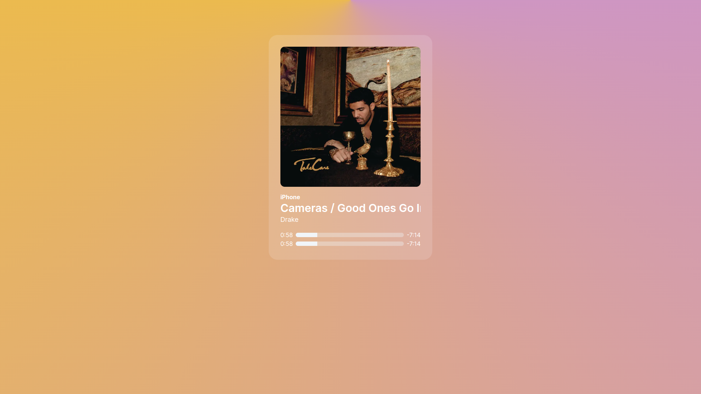

# Status music
Gerador de cards de músicas integrado com o Spotify.

## Documentação da Aplicação :weight_lifting:
Este repositório contém a implementação do Status-music uma aplicação construída em:

- NextJs - ^14

- Node.js 18
- NPM 9.8.1

## Instalação e configuração :computer:
- Faça o clone deste repositório: `git clone`
- Certifique-se de ter o Node.js 18 e NPM 9.8.1 instalados em sua máquina.
- Copie o arquivo **.env.example** para **.env** na raiz do projeto e defina as variáveis de ambiente necessárias para o seu ambiente.
- Execute `npm install` na pasta raiz do projeto para criar instalar as dependências.
- Por fim, execute `npm run dev` para subir a aplicação em modo de desenvolvimento.

<!-- ## Autenticação :closed_lock_with_key:
A aplicação utiliza a api do nextAuth no modo Credentials, foi feita algumas modificações no authOptions, em relação às seções de ***authorize*** e ***session***. -->

## RFs (Requisitos funcionais)

- [ ] Deve ser possível pesquisar por uma música;
- [ ] Deve ser possível se autenticar com Spotify;
- [ ] Deve ser possível baixar o card como imagem;

<!-- ## RNs (Regras de negócio)
- [x] O usuário não deve poder se cadastrar com um e-mail duplicado;
- [x] A gravação do tempo atual do episódio não deve ocorrer se o usuário não estiver logado;
- [x] A ação de favoritar um anime não deve ser possível para um usuário que não está logado;
- [x] Usuário não deve comentar em um anime caso nao esteja logado; -->

## RNFs (Requisitos não-funcionais)
- [ ] Alterar o background de acordo com o cover da música;